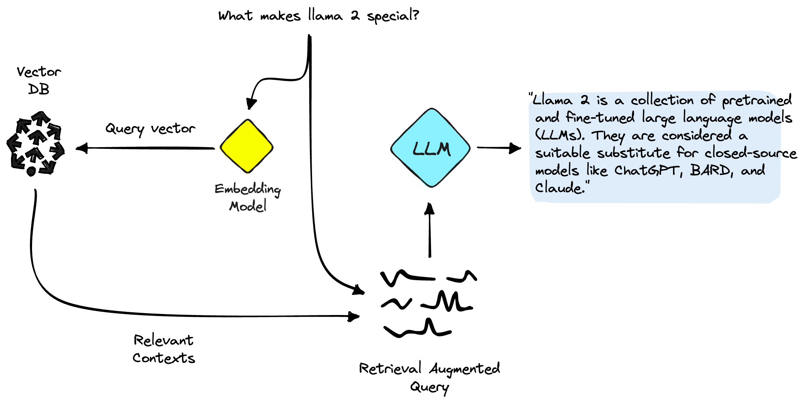

# chatbot_pinecone_RAG

In this project, I aim to explore the fascinating world of AI chatbots. I'll will be using LangChain, OpenAI, and Pinecone vector DB, to build a chatbot capable of learning from the external world using **R**etrieval **A**ugmented **G**eneration (RAG).

I'll will be using a dataset sourced from the Llama 2 ArXiv paper and other related papers to help our chatbot answer questions about the latest and greatest in the world of GenAI.

